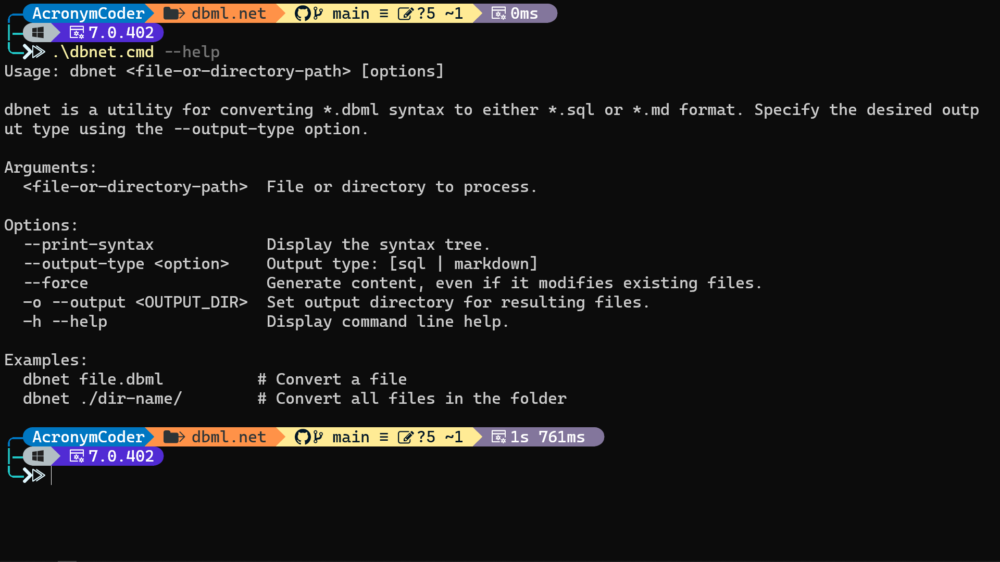

# dbml.net <!-- omit in toc -->

[](https://github.com/Catalin-Andronie/dbml.net/actions/workflows/build.yml)

**Inspired by [Holistics DBML](https://github.com/holistics/dbml) and tailored for .NET developers.**

**Abbreviations:**

- **DBML**: Database Markup Language

**Repository Contents:**

1. **DbmlNet Library:** A .NET parser library for parsing *.dbml files.
2. **dbnet CLI Tool:** A .NET CLI tool to generate SQL files from *.dbml inputs.


**Table of Contents:**

- [DbmlNet Parser Features](#dbmlnet-parser-features)
- [Prerequisites](#prerequisites)
- [Running the Solution](#running-the-solution)
- [Sample Databases](#sample-databases)
  - [Contoso Data Warehouse](#contoso-data-warehouse)
  - [AdventureWorks](#adventureworks)
  - [Wide World Importers](#wide-world-importers)
- [Building the Solution](#building-the-solution)
- [Unit Tests](#unit-tests)
- [Integration Tests](#integration-tests)
- [Code Coverage](#code-coverage)
- [Additional Commands](#additional-commands)

## DbmlNet Parser Features

**DbmlNet Features:**

- [X] [Project Definition](https://dbml.dbdiagram.io/docs/#project-definition)
- [X] [Schema Definition](https://dbml.dbdiagram.io/docs/#schema-definition)
- [X] [Public Schema](https://dbml.dbdiagram.io/docs/#public-schema)
- [ ] [Table Definition](https://dbml.dbdiagram.io/docs/#table-definition)
  - [ ] [Table Alias](https://dbml.dbdiagram.io/docs/#table-alias)
    - [ ] Alias tables for reference.
  - [X] [Table Notes](https://dbml.dbdiagram.io/docs/#table-notes)
  - [X] [Table Settings](https://dbml.dbdiagram.io/docs/#table-settings)
- [X] [Column Definition](https://dbml.dbdiagram.io/docs/#column-definition)
  - [X] [Column Settings](https://dbml.dbdiagram.io/docs/#column-settings)
  - [X] [Default Value](https://dbml.dbdiagram.io/docs/#default-value)
- [X] [Index Definition](https://dbml.dbdiagram.io/docs/#index-definition)
  - [X] [Index Settings](https://dbml.dbdiagram.io/docs/#index-settings)
- [X] [Relationships & Foreign Key Definitions](https://dbml.dbdiagram.io/docs/#relationships-foreign-key-definitions)
  - [X] [Relationship Settings](https://dbml.dbdiagram.io/docs/#relationship-settings)
  - [X] [Many-to-Many Relationship](https://dbml.dbdiagram.io/docs/#many-to-many-relationship)
- [ ] [Comments](https://dbml.dbdiagram.io/docs/#comments)
- [X] [Note Definition](https://dbml.dbdiagram.io/docs/#note-definition)
  - [X] [Project Notes](https://dbml.dbdiagram.io/docs/#project-notes)
  - [X] [Table Notes](https://dbml.dbdiagram.io/docs/#table-notes-2)
  - [X] [Column Notes](https://dbml.dbdiagram.io/docs/#column-notes)
- [ ] [Multi-line String](https://dbml.dbdiagram.io/docs/#multi-line-string)
- [ ] [Enum Definition](https://dbml.dbdiagram.io/docs/#enum-definition)
- [ ] [TableGroup](https://dbml.dbdiagram.io/docs/#tablegroup)
- [ ] [Syntax Consistency](https://dbml.dbdiagram.io/docs/#syntax-consistency)

## Prerequisites

1. Install the latest [.NET Core 7 SDK](https://dotnet.microsoft.com/download/dotnet/7.0).

2. Verify that *dotnet* is installed by running the following command:

   ```shell
   dotnet --version
   ```

3. Restore development tools by running:

   ```shell
   dotnet tool restore
   ```

## Running the Solution

To run `dbnet`, use the available scripts in the root folder based on your platform:

**Windows:**

```shell
./dbnet.cmd --help
```

**Apple and Linux:**

```shell
./dbnet.sh --help
```

The `--help` option provides usage instructions. You can provide a file or directory path as an input parameter.



For more examples, check the documentation.

## Sample Databases

The `./sample/` directory contains sample databases like [Contoso Data Warehouse](#contoso-data-warehouse), [AdventureWorks](#adventureworks), and [Wide World Importers](#wide-world-importers). Learning materials use the pattern `sample-*.dbml` for the file name.

**Visualize the Syntax Tree:**

Use the `--print` flag to visualize the syntax tree of a *.dbml file.

Example:

```shell
./dbnet.[cmd|sh] ./samples/sample-project.dbml --print
```

### Contoso Data Warehouse

A sample data warehouse demonstrating data loading into Azure SQL Data Warehouse.

### AdventureWorks

Sample databases and Analysis Services models for use with SQL Server.

### Wide World Importers

A new sample database for SQL Server 2016 and Azure SQL Database, illustrating core capabilities for transaction processing, data warehousing, analytics, and hybrid transaction and analytics processing (HTAP).

## Building the Solution

1. [Check the build runs on CI][CI-link] **--or--**

2. On the root folder, run:

   ```shell
   dotnet build
   ```

## Unit Tests

1. [Check test runs on CI][CI-link] **--or--**

2. On the root folder, run:

   ```shell
   dotnet cake --task=unit-tests
   ```

## Integration Tests

1. [Check test runs on CI][CI-link] **--or--**

2. On the root folder, run:

   ```shell
   dotnet cake --task=integration-tests
   ```

## Code Coverage

1. [Check coverage reports on CI][CI-link] **--or--**

2. On the root folder, run:

   ```shell
   dotnet cake --task=code-coverage
   ```

   - Automatically open coverage results with `-open-coverage-results`:

   ```shell
   dotnet cake --task=code-coverage --open-coverage-results
   ```

## Additional Commands

- Push commits one by one automatically:

  - Windows (PowerShell):

    ```powershell
    foreach ($rev in $(git rev-list --reverse origin/branch-name..branch-name))
    {
        git push origin ($rev + ":branch-name") -f
    }
    ```

  - Linux (Shell):

    ```shell
    for rev in $(git rev-list --reverse origin/branch-name..branch-name); do
        git push origin $rev:branch-name -f;
    done
    ```

<!-- Links: -->
[CI-link]: https://github.com/Catalin-Andronie/dbml.NET/actions/workflows/build.yml
